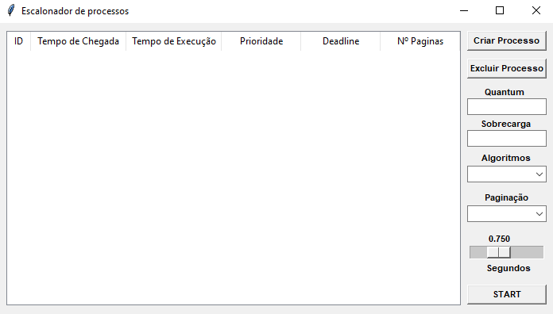
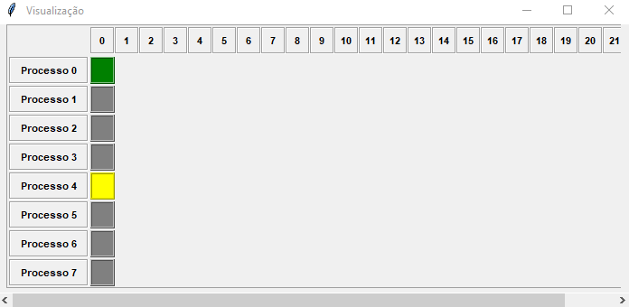

:brazil:
# Simulador Escalonador de Processos

## Bibliotecas necessárias
**Apenas se utiliza a biblioteca tkinter e ela vem imbutida no python a partir da versao 3.7 ou, você pode obtêlo usando:**
```py
pip install tk
```

  
## Visualização

*Imagens ilustrativas, o resultado muda conforme a quantidade de processos e outros parâmetros*


| Janela Principal | 
| :---: |
|  |

| Janela de Processos | 
| :---: |
|  |

| Janela de Disco e RAM | 
| :---: |
|  |


## Instruções

* Exeute o arquivo 'main.py' para que o programa funcione.
* Para utilizar é necessário criar os processos, especificar o quantum e sobrecarga, escolher o algoritmo de escalonamento e o de paginação. Após isso aperte o botão 'START' e a execução será feita em tempo real com as informações de memória, disco e turnaround em suas respectivas telas.


## Referências bibliográficas
Tkinter, **Tkinter Documentation**.https://docs.python.org/3/library/tkinter.html

## 